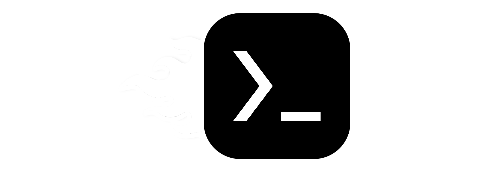

<a href="https://github.com/olegos2/mobox/tree/main">English</a>
&nbsp;&nbsp;| &nbsp;&nbsp;
Русский
&nbsp;&nbsp;| &nbsp;&nbsp;
<a href="https://github.com/olegos2/mobox/blob/main/README-ua.md">Українська</a>
&nbsp;&nbsp;| &nbsp;&nbsp;
<a href="https://github.com/olegos2/mobox/blob/main/README-pt_BR.md">Português Brasileiro</a>
&nbsp;&nbsp;| &nbsp;&nbsp;
<a href="https://github.com/olegos2/mobox/blob/main/README-pl.md">Polski</a>

##

`Mobox` - это проект, разработанный для запуска windows x86 приложений в [Termux](https://github.com/termux/termux-app), используя [Box64](https://github.com/ptitSeb/box64) и [Wine](https://www.winehq.org/).

# Установка
1. Установите
[Termux](https://f-droid.org/repo/com.termux_118.apk),
[Termux-X11](https://raw.githubusercontent.com/olegos2/mobox/main/components/termux-x11.apk) и
[Input Bridge](https://raw.githubusercontent.com/olegos2/mobox/main/components/inputbridge.apk).

2. Откройте termux и вставьте команду

```bash
curl -s -o ~/x https://raw.githubusercontent.com/olegos2/mobox/main/install && . ~/x
```

3. Введите `mobox` в termux.

# Конфигурация
## Wine
Wine может быть установлен или удален в меню `Manage packages`.
Для выбора контейнера wine, используйте опцию 4 в главном меню.
Mesa VirGL, Turnip, Wine Mono и Gecko могут быть установлены в Wine Start Menu.
## Настройки
### Переменные dynarec в Box86 и Box64
Есть два переключаемых меню для изменения переменных dynarec в меню настроек mobox.
Посмотрите [как использовать Box64](https://github.com/ptitSeb/box64/blob/main/docs/USAGE.md) и [как использовать Box86](https://github.com/ptitSeb/box86/blob/master/docs/USAGE.md), чтобы узнать больше о переменных dynarec.
### Настройки системы
Используйте меню `System settings` в mobox для локального изменения wine, пресета dxvk hud или настроек Turnip.
разрешение fallback использовано только когда разрешение x11 не может быть обнаружено автоматически.
Если у вас Snapdragon 8 Gen 1, 8+ Gen 1, 7+ Gen 2, активируйте вторую опцию в `select a7xx flickering fix (TU_DEBUG)` в меню `System settings`.
### Root настройки
Если у вас есть Root, то можно использовать OOM Adjuster, который помогает сохранять Termux в фоне.
## Termux-X11 preferences
* `Display resolution mode` exact
* `Display resolution` 1280x720
* `Reseed Screen While Soft Keyboard is open` OFF
* `Fullscreen on device display` ON
* `Force Landscape orientation` ON
* `Hide display cutout` ON
* `Show additional keyboard` OFF
* `Prefer scancodes when possible` ON
## Управление
Для сенсорного управления требуется приложение Input Bridge
## Удаление
Используйте меню `Backup and restore` для удаления mobox.
## Отладка
Для включения отладки - выберите опцию 2 в меню Mobox -> Settings -> Debug settings. Путь до логов - /sdcard/mobox_log.txt

## Поддержка
### Android
* Рекомендован `Android 10` или выше.
### Устройство
* Большинство Android телефонов может запускать `mobox` и игры с DirectX 9, используя Mesa VirGL.
* Рекомендовано устройство со Snapdragon с Adreno 6xx или Adreno 725-740 для получения лучшей производительности и совместимости с Turnip+DXVK.
### Root
* Root не требуется.

## Известные проблемы
* Если termux вылетает, когда пытаетесь зайти в меню mobox, удалите пользовательские скрипты темы:
```bash
rm -rf $PREFIX/glibc/opt/termux-style
```
* У некоторых устройств могут быть проблемы с зависанием создания префикса при установке PhysX, в таком случае измените настройки в меню `Compatibility settings`
* Для устройства с SD845, отключите dri3 в меню `Compatibility settings`

## Поддержать mobox
[boosty](https://boosty.to/olegos/donate)

#
Большое спасибо Hugo, JeezDisReez, ptitSeb, MishkaKolos, Xanzo, Jotaros, Maxython и другим за помощь.

[MishkaKolos Discord](https://discord.gg/ZAQnZzbCXq)


## Сторонние приложения

[glibc-packages](https://github.com/termux-pacman/glibc-packages)

[Box64](https://github.com/ptitSeb/box64)

[Box86](https://github.com/ptitSeb/box86)

[DXVK](https://github.com/doitsujin/dxvk)

[DXVK-ASYNC](https://github.com/Sporif/dxvk-async)

[DXVK-GPLASYNC](https://gitlab.com/Ph42oN/dxvk-gplasync)

[VKD3D](https://github.com/lutris/vkd3d)

[D8VK](https://github.com/AlpyneDreams/d8vk)

[Termux-app](https://github.com/termux/termux-app)

[Termux-x11](https://github.com/termux/termux-x11)

[Wine](https://wiki.winehq.org/Licensing)

[wine-ge-custom](https://github.com/GloriousEggroll/wine-ge-custom)

[Mesa](https://docs.mesa3d.org/license.html)

[mesa-zink-11.06.22](https://github.com/alexvorxx/mesa-zink-11.06.22)

[Mesa-VirGL](https://github.com/alexvorxx/Mesa-VirGL)


